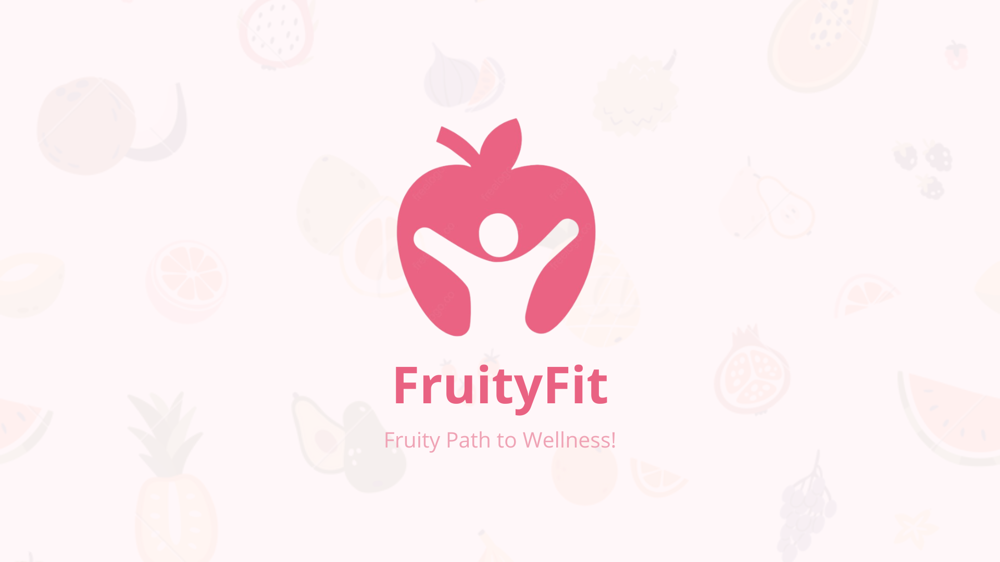

<p align="center">
  
</p>

<h1 align="center">FruityFit</h1>

<div align="center">
CH2-PS327
</div>

## CH2-PS327 Contributors

| Name  | Bangkit-ID | Learning Path  | 
| :---: | :---: | :---: |
|  Evander Gabriel  | M239BSY0797  | Machine Learning  |
|  Christopher Ade Wiyanto  | M239BSY1097  | Machine Learning  |
|  Sonya Oktavia  | M200BSX1152  | Machine Learning  |
| Danar Hadi Bachtiar | C253BSY3294 | Cloud Computing |
| Muhamad Arya Al Ghifari Wibowo | C134BSY3568  | Cloud Computing |
| Melisa Wijaya | A239BSX2324 | Mobile Development |
| Adam Rayhant Laksono | A009BSY2477  | Mobile Development |

## Cloud Computing 

## REST API Documentation

```
https://documenter.getpostman.com/view/23146615/2s9YeHZAPM 
```

## Cloud Architecture

<p align="center">
  
</p>


## Google Cloud Platfrom Pricing

<p align="center">
  
</p>

## Project Installation
### Components and Requirements
* MySQL database running on Google Cloud Platform
* Cloud Storage Bucket 
* REST API developed using Express and Flask
* Deployed REST API on App Engine
* Deployed Machine Learning Models on Cloud Run

### Workflow
#### 1. Clone The Project 
``` 
git clone https://github.com/FruityFit/Cloud-Computing.git 
```

#### 2. Create Cloud Storage Bucket
- Open Cloud Console, head to `Cloud Storage > Buckets > Create`
- Create necessary folder, such as `pfp and products` 
- Set bucket permission as public with `grant access` to `allUsers` as `Storage Object Viewer`
- Create service account key for storage bucket, head to `APIs & Services > Credentials > Create service account`

#### 3. Create SQL Instance
- Open Cloud Console, head to `Cloud SQL > Create Instance > MySQL`
- Create new database on your SQL instances
- Create tables based on schema below
<p align="center">
  
</p>


#### 4. Deploy  REST API to App Engine & Cloud Run
- Open cloud shell editor and go to `API` folder
- Add your storage bucket service account to `API` folder
- Run `gcloud app deploy`. When finished, it will show your deployed service URL
- To deploy the models, go to `Cloud Run - Fruit Classification` folder and create the docker image then push to `Artifact Registry`
- Open cloud console and head to `Cloud Run`
- Create a new service and fills the required fields. When deployment finished, it will show your service URL
- Do the same for `Cloud Run - Chatbot` folder
